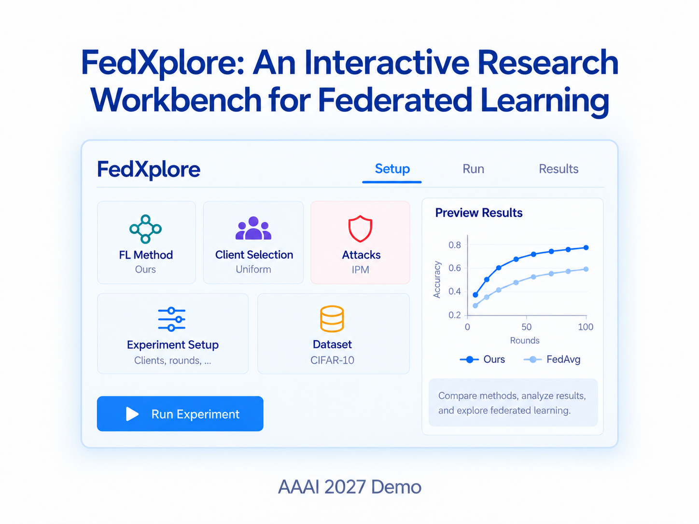
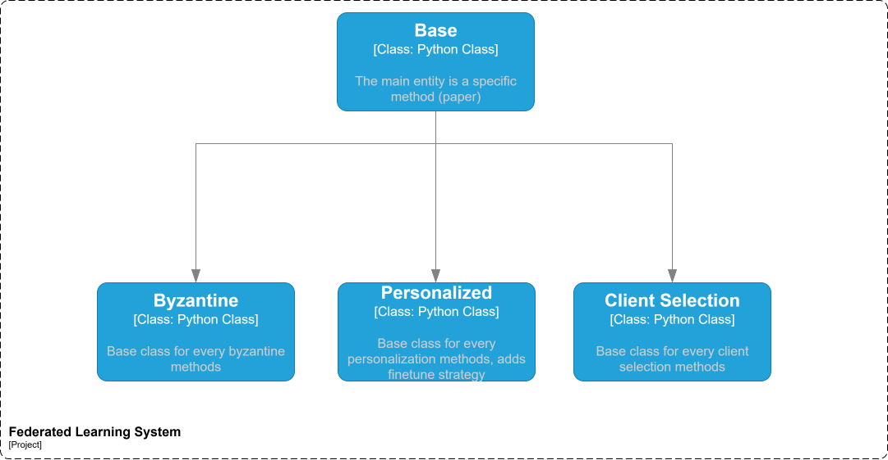
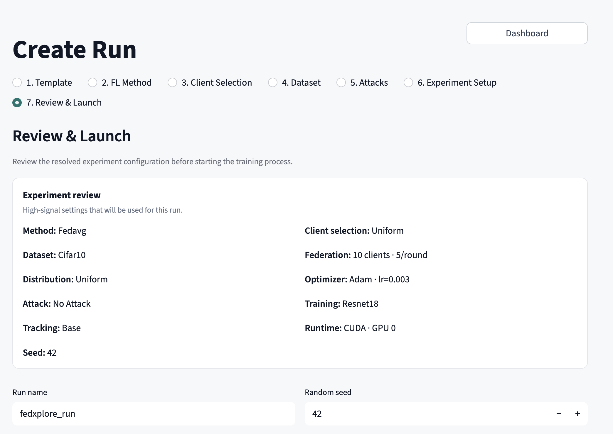
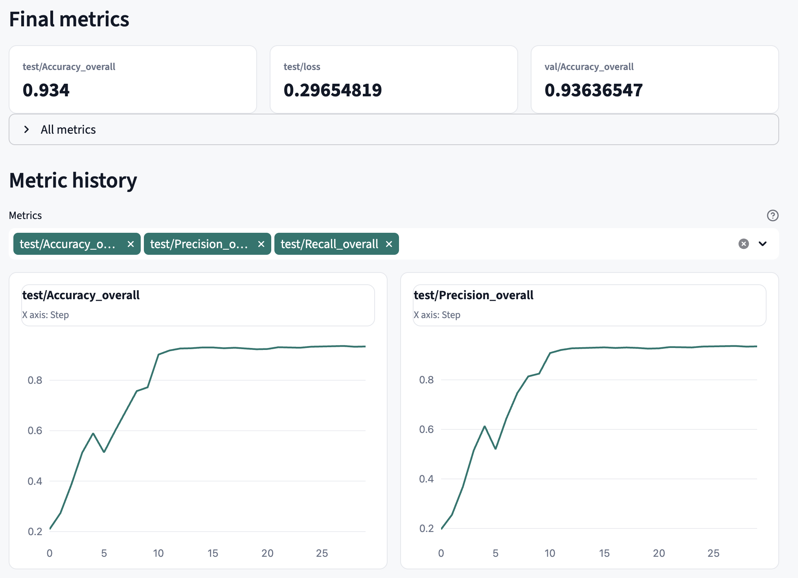
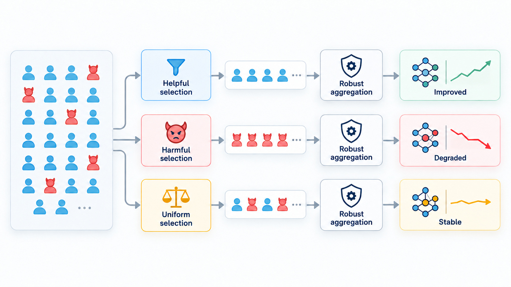
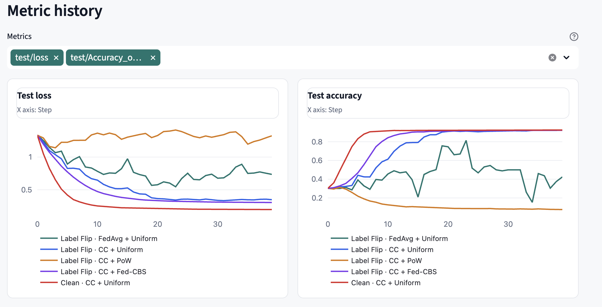
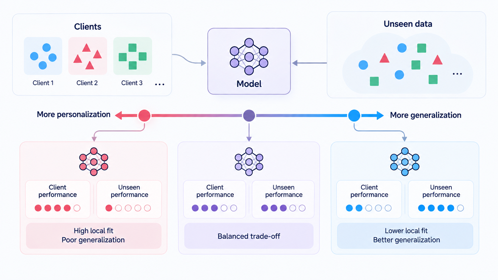
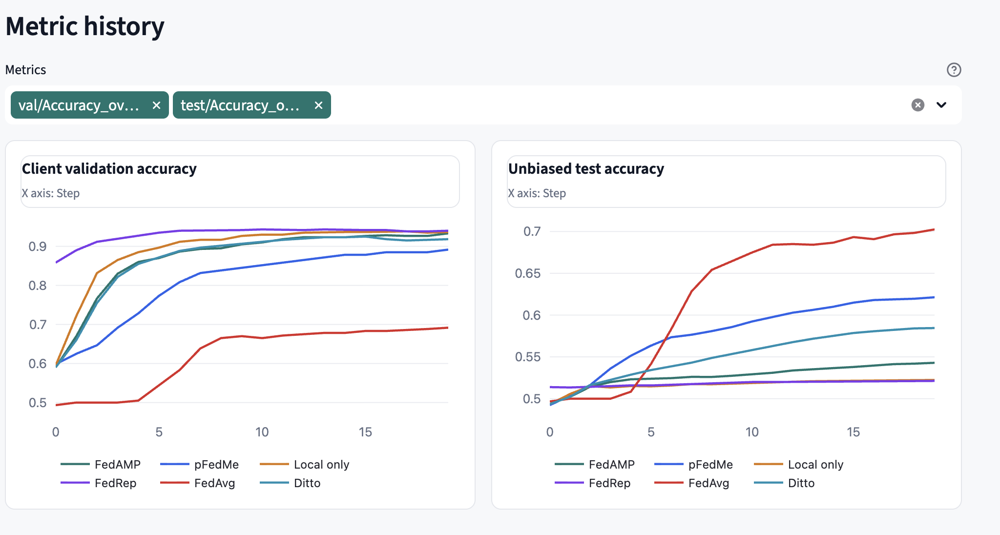

# FedXplore

<p align="center">
  <strong>An interactive research workbench for federated learning</strong>
</p>

<p align="center">
  
</p>

FedXplore helps researchers build, run, and compare federated learning
experiments from a web interface. Combine federated methods, client selection,
data distributions, Byzantine attacks and defences, and personalization in one
workflow, then inspect metrics, artifacts, and configuration differences.

| Build | Run | Compare |
| :---: | :---: | :---: |
| Compose an experiment from reusable research components | Start local training and follow its status | Explore live metrics, artifacts, parameters, and provenance |

[Quick start](#quick-start) · [Create and inspect a run](#create-and-inspect-a-run) ·
[Examples](#examples) · [Documentation](#technical-overview-and-documentation)

## Technical overview and documentation

The UI is an interactive layer over the existing Hydra configuration and
`src/train.py` execution path. The framework separates the federated method,
server, clients, manager, dataset, and trainer so that research components can
be changed independently and studied together.

<p align="center">
  
</p>

**Documentation:** [C4 architecture](docs/C4.md) ·
[Configuration](docs/config.md) · [Federated methods](docs/method.md) ·
[Attacks and defences](docs/attacks_and_defences.md) ·
[Client selection](docs/client_selection.md) ·
[Personalization](docs/personalization.md) · [UI technical reference](docs/ui.md)

## Quick start

Requires Python 3.8 or newer. GPU execution is optional; the curated examples
run on CPU.

```bash
python3 -m venv .venv
source .venv/bin/activate
python -m pip install --upgrade pip
python -m pip install -e .
python -m pip install -r ui/requirements-ui.txt
python -m streamlit run ui/run_ui.py
```

Open the local URL printed by Streamlit.

## Create and inspect a run

Open **Create Run**, choose the method, client selection, dataset, attack, and
training setup, then review the resolved configuration and launch command.
After launch, the run appears on the **Dashboard** and its metrics update while
training is in progress.

<p align="center">
  <a href="docs/assets/readme/create-run-review.png">
    
  </a>
  <a href="docs/assets/readme/run-analytics.png">
    
  </a>
</p>

Review the resolved experiment, configuration checks, and exact launch command
before starting training, then follow final values and metric histories. Select
either image to open it at full size.

Select multiple runs on the Dashboard to compare metric histories and
configuration differences. Runs created through **Create Run** can be cloned
for editing, and saved runs can be started again from their overrides.

## Examples

The **Examples** page launches compact, predefined suites on CPU and opens the
comparison automatically. They provide a fast way to explore interactions
between federated learning components.

### Client Selection × Byzantine Robustness

How does the client selection policy affect robust aggregation when malicious
clients flip their labels? This suite compares five controlled conditions with
Centered Clipping, FedAvg, Uniform, Power-of-Choice, and Fed-CBS.

<p align="center">
  <a href="ui/assets/examples/cs_byz.png">
    
  </a>
</p>

<p align="center"><em>Research question: the interaction between client selection and robust aggregation.</em></p>

<p align="center">
  <a href="docs/assets/readme/byzantine-comparison.png">
    
  </a>
</p>

<p align="center"><em>Live comparison of the five experiment conditions.</em></p>

In this synthetic example, changing only the selector changes how often
malicious clients participate and produces sharply different learning curves.

### Personalization vs Generalization

How does adaptation to each client's data affect performance on a shared,
balanced test distribution? This suite compares FedAvg, local training, Ditto,
pFedMe, FedRep, and FedAMP on the same synthetic task.

<p align="center">
  <a href="ui/assets/examples/personalization.png">
    
  </a>
</p>

<p align="center"><em>Research question: the trade-off between local adaptation and generalization.</em></p>

<p align="center">
  <a href="docs/assets/readme/personalization-comparison.png">
    
  </a>
</p>

<p align="center"><em>Live comparison of local validation and balanced test accuracy.</em></p>

The paired charts make the trade-off visible: a method can fit local client
distributions well while performing worse on the balanced population test.

The exact suite configurations are available in
[`ui/examples.yaml`](ui/examples.yaml).

## License

See [LICENSE](LICENSE).
